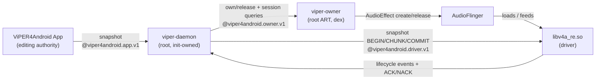

# Daemon-Owned Effect Handle and Session Tracking

**Status:** proposed, awaiting review
**Date:** 2026-08-20
**Repositories:** `ViPERFX_RE` (daemon, module, owner), `ViPER4Android` (App shell)

## Problem

Audio processing dies with the App. Every `AudioEffect` handle is created by
`ViperService` (`ViperEffect.create()`), so AudioFlinger destroys the effect
module when Binder drops the App's client reference. `START_STICKY` and
foreground-service priority reduce eviction odds; they do not change ownership.
The App is therefore load-bearing for playback, which is the defect.

Session tracking has the same root cause from the other side. `AudioSessionMonitor`
runs in the App, has no `MODIFY_AUDIO_ROUTING`, and reconstructs the player list by
shelling out to `dumpsys` through `RootShell` and parsing text. It needs root
anyway, and it stops observing the moment the App is gone.

Both problems reduce to one fact: **handle ownership and session observation belong
to a process whose lifetime the system controls, not to the UI.**

## Non-Goals

- Not replacing AudioFlinger effect lifecycle. AudioFlinger still creates and
  destroys modules; the owner only holds a client reference.
- Not linking the daemon against `libaudioclient`. That is not a stable NDK ABI and
  the existing plan forbids HIDL/AIDL/hidden-Binder dependencies on the control plane.
- Not removing the App's editing authority. The App remains the source of desired state.
- Not deleting the legacy App-owned backend. It stays as the no-daemon fallback.

## Device Evidence

Measured on this device (Android 15 / SDK 35, KernelSU root context `u:r:ksu:s0`,
SELinux enforcing) with throwaway ART probes launched by `app_process64`. Probes and
their dex were removed afterwards; device state re-verified clean.

| Question | Result |
|---|---|
| Can a root non-App process create the session 0 handle? | Yes. `hasControl=true`, effect id allocated by AudioFlinger. |
| Is the module's lifetime bound to that owner? | Yes. ViPER module count 1→2 on start, 2→1 on `kill -9` of the owner, with the App never running. |
| Does it survive losing its launching shell? | Yes. `setsid` owner kept the module alive across SSH disconnect. |
| Can it write and read back driver parameters? | Yes. `PARAM_GET_DRIVER_VERSION_CODE` returned `20260726`; `setParameter` returned `SUCCESS`. |
| Is it genuinely in the audio path? | Yes. Driver-reported `PARAM_GET_STREAMING` was `0` before playback and `1` throughout a tone. |
| Does the root owner get session visibility? | Yes. System `Context` via `ActivityThread.systemMain()`, `MODIFY_AUDIO_ROUTING` **granted**, `AudioPlaybackCallback` delivering session ids and client uids. |

The last row is the one that changes scope: session observation in the owner needs
no `dumpsys` parsing and no root-shell hop, so the App stops being the tracking
mechanism rather than having its tracking ported into the owner.

### Two defects this uncovered in existing daemon session tracking

Both are live in `ViPERFX_RE` today and must be fixed for the owner to work.

1. **Restore is not triggered by a new context.** `DaemonRuntime::RunOnce()` only
   restores when `route_restore_pending_ && driver_connected && RouteSettled()`, and
   `route_restore_pending_` is set solely by a route change. With a root-owned handle
   created while the route was unchanged, `live_contexts` went 1→2 while `apply_acks`
   stayed at 8 and `restores_attempted` at 1: the daemon saw the context and applied
   nothing. An owner that creates a handle at boot would get an unconfigured effect.
2. **Rescan never reconciles.** `SessionRegistry::RescanComplete()` and
   `RescanNeeded()` have no production caller; only `MarkStaleAfter()` is called, from
   `DriverEventServer::Poll()` on a sequence gap. Stale entries are therefore marked
   and never collected. Observed directly: `live_contexts=1` while AudioFlinger
   reported zero ViPER instances — a phantom context, and `rescan_requests=6` with no
   reconciliation. Session tracking that cannot forget is not tracking.

## Architecture

One new process is added: `viper-owner`, a small ART program launched by
`viper-daemon`. It holds the `AudioEffect` client reference and observes playback
sessions. It does not know the DSP parameter model, does not read App preferences,
and does not touch snapshots.



The parameter path is unchanged and does not pass through the owner. That is the
central simplification: parameters already travel daemon→driver over
`@viper4android.driver.v1` and are applied by `SnapshotApplyController`. The owner
only makes a driver context *exist*; the daemon then fills it exactly as it fills a
context created by any other client today.

### Why a separate process rather than the daemon itself

Creating an `AudioEffect` requires the Java framework client (`android.media.audiofx`).
`viper-daemon` is a C++ executable and, per the existing Global Constraints, must not
link `libaudioclient` or generated HAL interfaces. Hosting the handle in a tiny ART
process keeps that constraint intact and confines all framework coupling to one
replaceable binary. It also isolates failure: an owner crash costs one effect module
and an init-supervised restart, not the daemon's route state or snapshot store.

### Components

**`viper-owner` (new, `ViPERFX_RE/owner/`)**

- `EffectOwner`: creates the session 0 handle, sets enabled, releases on command.
  Uses the same reflected 4-arg `AudioEffect(UUID, UUID, int, int)` constructor the
  App uses, because that is the only public way to name an effect by UUID.
- `SessionObserver`: registers `AudioManager.AudioPlaybackCallback` on a system
  `Context` obtained via `ActivityThread.systemMain()`, and reports
  `(session_id, client_uid, state)` deltas.
- `OwnerLink`: `LocalSocket` client on `@viper4android.owner.v1`. Receives OWN/RELEASE,
  sends OWNED/RELEASED/SESSION_DELTA. Bounded frames, same framing as the driver bridge.

**`viper-daemon` (modified)**

- `OwnerServer` (new): abstract `SOCK_SEQPACKET` listener on `@viper4android.owner.v1`,
  peer-credential-restricted to uid 0. Mirrors `DriverEventServer`'s structure.
- `OwnerSupervisor` (new): decides when a handle should exist, spawns/reaps the owner.
- `SessionRegistry` (modified): gains playback-session entries alongside driver
  contexts, and gets its rescan reconciliation wired up (defect 2).
- `DaemonRuntime` (modified): restores on a new driver context, not only on route
  change (defect 1).

**App (modified)**

- `AudioSessionMonitor`: demoted, not deleted. It is the only driver of the fallback's
  per-session path (`ViperService.kt:311` starts it whenever global mode is off), so
  deleting it would break the no-daemon fallback that Non-Goals keeps. It stops being
  the tracking mechanism — the owner's `SessionObserver` takes that role whenever the
  daemon owns the handle — and stays only as fallback plumbing, started only when no
  daemon backend is active. Its `dumpsys`-parsing path is then dead on daemon installs.
- `ViperEffect`: already frozen as `@Deprecated`; retained as the no-daemon fallback.

## Data Flow

### Boot, no App involved

1. init starts `viper-daemon` (`class late_start`, already implemented).
2. Daemon polls its route, loads the matching snapshot, and waits for a driver.
3. Daemon spawns `viper-owner` and sends OWN.
4. Owner creates the session 0 handle. AudioFlinger loads `libv4a_re.so`, which
   connects the driver bridge and publishes `CONTEXT_CREATED`/`CONTEXT_CONFIGURED`.
5. Daemon sees the new context and applies the snapshot (this is the new trigger from
   defect 1). Driver ACKs.
6. Audio is processed with correct per-route state. The App has never run.

### App edits state

Unchanged from today: App builds a snapshot, sends it on `@viper4android.app.v1`,
daemon arbitrates generations and streams it to the driver. The owner is not involved;
it neither sees nor forwards parameters.

### App dies

Nothing happens to the handle. The owner is a different process; AudioFlinger has no
reason to tear the module down. This is the entire point of the change, and it is what
the device evidence above measured directly.

### Owner dies

AudioFlinger destroys the module, the driver publishes `CONTEXT_RELEASED`, and the
registry drops the entry. `OwnerSupervisor` observes the child's exit and respawns it
with bounded backoff; the new handle produces a new context, which re-triggers restore
through the same path as boot. Processing resumes without the App.

### Session lifecycle

The owner reports session deltas to the daemon. In global mode the daemon does nothing
with them beyond registry bookkeeping, because one session 0 handle already covers all
output. Per-session mode uses them to decide which sessions warrant their own handle.
Session ids are reported, never guessed: `AudioPlaybackConfiguration.getSessionId()` is
read on a Context that holds `MODIFY_AUDIO_ROUTING`, which is why the values are real
rather than the zeros an unprivileged caller sees.

## Error Handling

Every failure mode degrades to a working configuration rather than silence.

| Failure | Behaviour |
|---|---|
| Owner binary or dex missing | Daemon logs it, does not spawn, leaves the App's legacy backend in charge. |
| Owner spawn fails repeatedly | Bounded backoff, then give up and report `owner_state=failed` in `daemon.state`. No spin. |
| Owner cannot create the handle | Owner reports OWN_FAILED with the exception class; daemon does not retry blindly, it reports and waits for the next trigger. |
| Owner connects but never sends OWNED | Treated as failed after a timeout; killed and respawned once, then reported. |
| Non-root peer connects to the owner socket | Rejected on peer credentials, counted in `daemon.state`, connection dropped. |
| Snapshot apply NACKs | Existing behaviour: counted, reported; handle stays, state is whatever the driver last accepted. |
| Daemon dies | init restarts it. The orphaned owner keeps processing with its last-applied state; the restarted daemon reconciles via rescan rather than killing a working handle. |

The last row is a deliberate choice: a daemon restart must not interrupt audio. The
owner is adopted, not replaced, which requires the rescan reconciliation from defect 2
to actually work.

## Owner Protocol

A third abstract socket, `@viper4android.owner.v1`, kept separate from the driver and
App endpoints for the same reason those two are separate: the peers have different
trust. The driver endpoint admits root/audioserver, the App endpoint admits an ordinary
uid, and this one admits uid 0 only. Reusing an existing endpoint would widen its
accepted peer set.

Framing is the existing 36-byte `FrameHeader` with CRC32 payloads, so the codec, the
bounded-frame rules, and the malformed-input tests are shared rather than reinvented.

| Message | Direction | Payload |
|---|---|---|
| `OWNER_HELLO` | owner → daemon | protocol version, owner pid, boot id |
| `OWNER_HELLO_ACK` | daemon → owner | accepted flag, daemon generation |
| `OWN_SESSION` | daemon → owner | session id (0 for global), effect type uuid selector |
| `OWNED` | owner → daemon | session id, AudioFlinger effect id, `has_control` |
| `OWN_FAILED` | owner → daemon | session id, bounded reason code |
| `RELEASE_SESSION` | daemon → owner | session id |
| `RELEASED` | owner → daemon | session id |
| `SESSION_DELTA` | owner → daemon | session id, client uid, appeared/vanished |

`OWN_SESSION` carries a type-uuid *selector*, not a raw UUID: the two accepted values
are the HIDL and AIDL effect types the driver registers. A selector keeps the daemon
from being a channel for creating arbitrary effects.

## State File Additions

`/data/adb/viper4android/daemon.state` gains keys the App's status UI already knows how
to ignore-if-absent, so an older App reads a newer daemon safely:

```
owner_state=absent|starting|owned|failed
owner_pid=<pid or 0>
owner_effect_id=<AudioFlinger effect id or 0>
owner_restarts=<count>
tracked_sessions=<count>
```

`owner_state` is what makes the difference visible in the UI: today "daemon running"
says nothing about whether anything owns a handle.

## Testing

Host tests, run through the existing CTest and Gradle targets:

- `owner_protocol_test`: frame round-trip, CRC rejection, unknown message rejection,
  selector validation rejecting an arbitrary UUID, bounded payload rejection.
- `owner_supervisor_test`: spawn decision, bounded backoff, give-up after repeated
  failure, adoption of an existing owner after daemon restart, no respawn storm.
- `session_registry_test` (extended): playback-session entries, and the rescan
  reconciliation defect — mark stale, complete rescan, assert the phantom entry is
  collected. This test fails against today's code, which is the point.
- `daemon_runtime_test` (extended): a new driver context triggers restore with no route
  change. Also fails today.
- `RouteRestoreIntegrationTest` (extended): real `DaemonRuntime` against real
  `ViperContext` with a fake owner, asserting boot ordering owner→context→apply→ACK.

Device verification, which host tests cannot cover:

- Kill the App with a tone playing; assert the ViPER module count is unchanged and
  driver-reported `PARAM_GET_STREAMING` stays `1`. This is the acceptance criterion for
  the whole change and reuses the probe method already validated above.
- Kill the owner; assert respawn, a fresh effect id, and a re-applied snapshot.
- Kill the daemon; assert audio continues and the restarted daemon adopts the owner.

## Rollout

The owner is gated on the same unresolved prerequisite as the daemon itself: Task 5
Step 6 of the existing plan still needs a reboot to confirm init imports
`viper-daemon.rc`. Until then the daemon does not run on a fresh boot, so the owner
cannot be the only path to audio. Ordering follows from that:

1. Fix the two session-tracking defects. They are bugs in shipped daemon code and are
   worth fixing regardless of the owner.
2. Add the owner protocol and supervisor with host tests, owner not yet spawned.
3. Enable spawning behind `owner_enabled` in daemon config, default off.
4. Device-verify App-death survival, then default on.
5. Demote `AudioSessionMonitor` to fallback-only: start it only when no daemon backend
   is active, once the owner is the default and has been device-verified.

Step 5 is last on purpose: cutting the App's tracking over before the owner is proven
would leave no working per-session path if the owner turns out to need rework.
